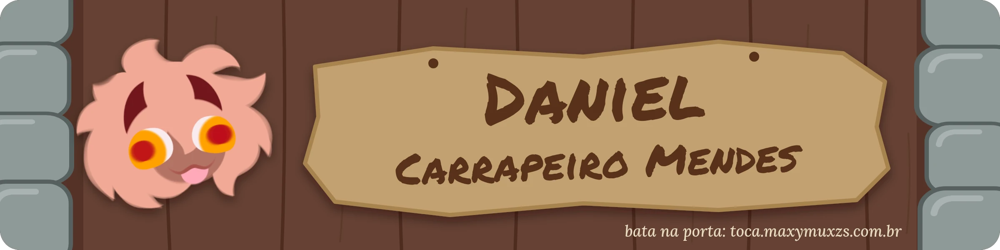
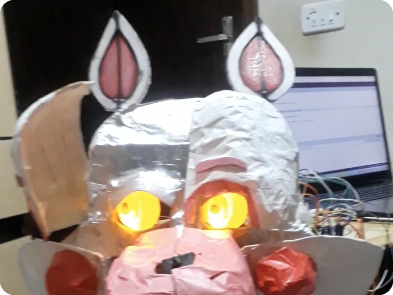
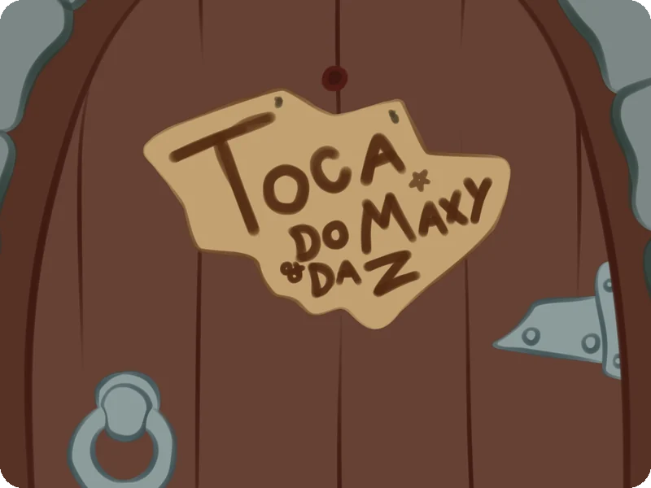
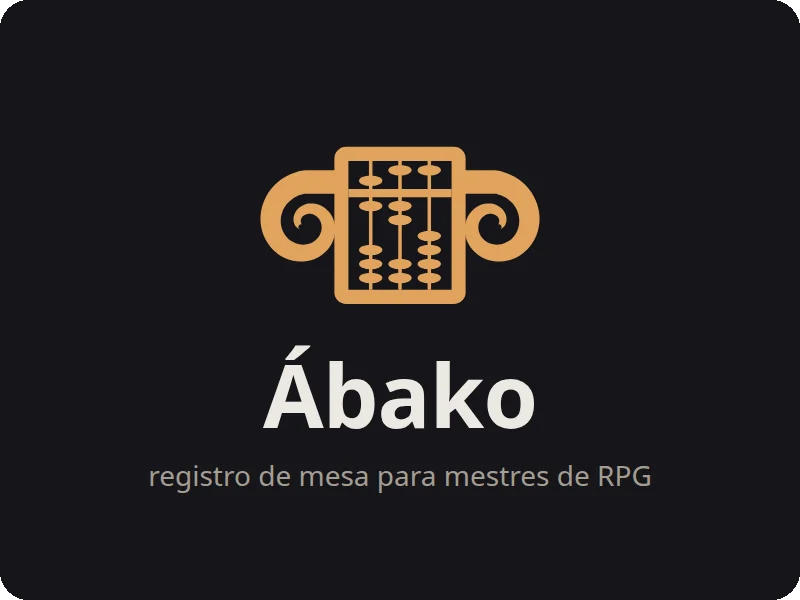

  
  
  

Último semestre de **Análise e Desenvolvimento de Sistemas** — FATEC Ourinhos, SP.

Comecei programando hardware no curso técnico de Automação Industrial e acabei indo parar no desenvolvimento web. Os dois ensinam a mesma lição por caminhos diferentes: ou funciona, ou não funciona — e o computador não aceita argumentação.

---

## Projetos

Meus projetos pessoais nascem do que eu gosto fora do código: jogos, desenho e RPG de mesa.

<table>
  <tr>
    <td width="33%" align="center" valign="top">
      
       <b>Animatrônico</b>
    </td>
    <td width="33%" align="center" valign="top">
      
       <b>A Toca</b>
    </td>
    <td width="33%" align="center" valign="top">
      
       <b>Ábako</b>
    </td>
  </tr>
</table>

### Animatrônico Funtime Foxy

Busto animatrônico do Funtime Foxy, de *Five Nights at Freddy's*: seis servos, LED e buzzer num Arduino UNO. Cinco rotinas sorteadas, cada uma com uma música que eu transcrevi nota por nota. TCC do técnico, em dupla: a eletrônica e a programação foram minhas. Em 2026 reli o código e listei o que eu faria diferente hoje.

`C++` `Arduino` · ▶ [Vídeo](https://youtu.be/5WHJtwz_iqg) · [Código](https://github.com/Daniel-Carrapeiro-Mendes/animatronico-funtime-foxy)

### A Toca

Meu site pessoal, ainda em construção. Por enquanto é só a porta: você bate, e ela responde. Eu desenho a arte e escrevo o código em HTML, CSS e JavaScript puros, sem framework.

`HTML` `CSS` `JavaScript` `Cloudflare Pages` · ↗ [Bater na porta](https://toca.maxymuxzs.com.br)

### Ábako

Contador de XP para mestres de RPG de mesa. O mestre cola as anotações da sessão do jeito que já escreve, e o Ábako soma os pontos por personagem, acumula a campanha e mostra onde as contas não fecham. Sem servidor e sem conta: os dados ficam no navegador. Já uso nas minhas mesas.

`JavaScript` `Vite` `Vitest` · ↗ [Abrir o Ábako](https://abako.maxymuxzs.com.br)

### Outros projetos

- **[claude-setup](https://github.com/Daniel-Carrapeiro-Mendes/claude-setup)** — como eu configurei o Claude Code para me ensinar, e não para fazer por mim: meus `CLAUDE.md` e minhas skills.
- **[shut-down](https://github.com/Daniel-Carrapeiro-Mendes/shut-down)** — bot de Telegram que desliga, reinicia, suspende ou bloqueia o meu computador de longe. Python + systemd.
- **[Calculadora de IP](https://daniel-carrapeiro-mendes.github.io/CalculadoraIP/)** — você digita um IP com prefixo (`192.168.0.10/24`) e ela mostra a máscara, a rede, o broadcast e a faixa de hosts. JavaScript numa página só. ([código](https://github.com/Daniel-Carrapeiro-Mendes/CalculadoraIP))

---

## Stack

| Área | Tecnologias |
|---|---|
| **Back-end** |    |
| **Banco de dados** |    |
| **Front-end** |     |
| **Sistemas embarcados** |   |
| **Ferramentas** |     |
| **Contato acadêmico** | C · Java |

---

## Fora do código

**Desenho** desde sempre e estou estudando **animação**. Boa parte do meu jeito de resolver problema veio daí: começar pelo esboço, errar barato, refazer.

Sou **mestre de RPG de mesa há três anos**. Na prática isso virou treino semanal de preparar estrutura, conduzir um grupo, improvisar quando o plano vai por água abaixo e segurar a atenção de gente por horas seguidas. É também de onde saiu o [Ábako](https://abako.maxymuxzs.com.br).

Tenho um canal no **YouTube** sobre jogos, teorias e RPG de mesa, com publicação fixa duas vezes por semana. Manter esse ritmo — roteiro, gravação e edição, toda semana, sem falhar — é a coisa mais parecida com disciplina profissional que eu já construí.

  
  
  

---

**Aberto a estágio ou primeira oportunidade como desenvolvedor.** Me chama por [e-mail](mailto:danielcarrapeiromendesdev@gmail.com) ou no [LinkedIn](https://www.linkedin.com/in/daniel-carrapeiro-mendes-6701a23b2).
